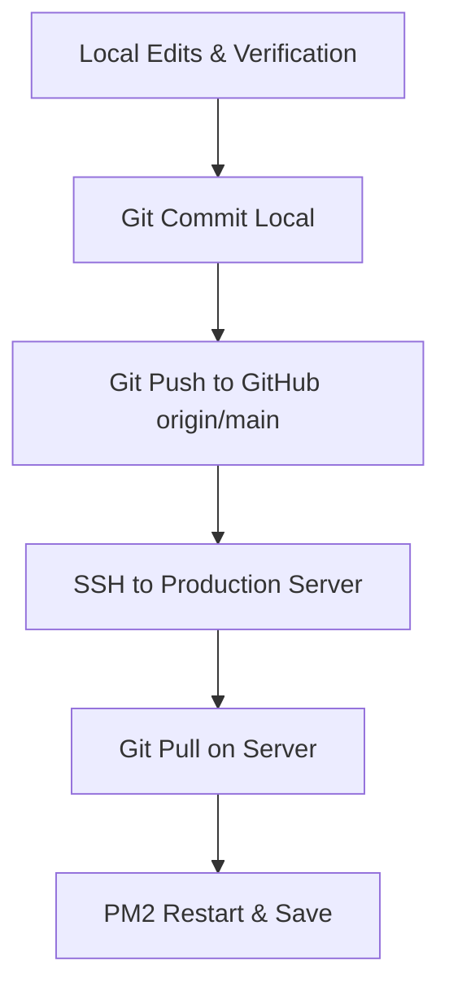

# AETHER // Deployment & Workflow Guide

This document defines the official deployment workflow and repository architecture for the Aether landing page project. To prevent conflicts and maintain a single source of truth, follow these guidelines.

---

## 🎯 Repository & Directory Architecture

1. **Official Source of Truth (GitHub)**:
   - **Repository URL**: `https://github.com/ecoartic/xyz1.git`
   - **Branch**: `main`

2. **Local Development Workspace**:
   - **Primary Directory**: `c:\Users\ecoartic\Downloads\note`
   - **Backup/Secondary Directory**: `D:\antigravity projects\xyz` (Sync matches local edits)

3. **Production Server environment**:
   - **Directory Path**: `/root/xyz1`
   - **PM2 Process Name**: `aether-site`

---

## 🔄 Step-by-Step Deployment Workflow

Always develop and test changes locally. Never modify files directly on the production server.



### 1. Local Development & Verification
- Perform edits using Antigravity or your local IDE.
- Verify changes by running the local server (`http://localhost:8082/` and `/admin.html`).

### 2. Commit & Push Changes
Stage and push your changes to the primary repository:
```bash
# Add modifications
git add .

# Create descriptive commit
git commit -m "feat/fix: descriptive change message"

# Push to primary origin
git push origin main
```

### 3. Apply Update on Production Server
SSH into your production server and pull the updates:
```bash
# Navigate to production directory
cd /root/xyz1

# Pull newest commits
git pull origin main

# Restart the application runner
pm2 restart aether-site

# Save current PM2 process list configuration
pm2 save
```

---

## 🔒 Security Configuration Reference

- **Admin Authentication**: Uses standard HTTP Basic Authentication.
  - **Username**: `Admin`
  - **Password**: `Eco1360724@`
- **CSP (Content-Security-Policy)**:
  - Controlled via environment variable `ALLOW_UNSAFE_EVAL` (default `false`).
  - Toggle to `true` if dynamic runtime scripts require execution:
    ```bash
    ALLOW_UNSAFE_EVAL=true pm2 restart aether-site
    ```
